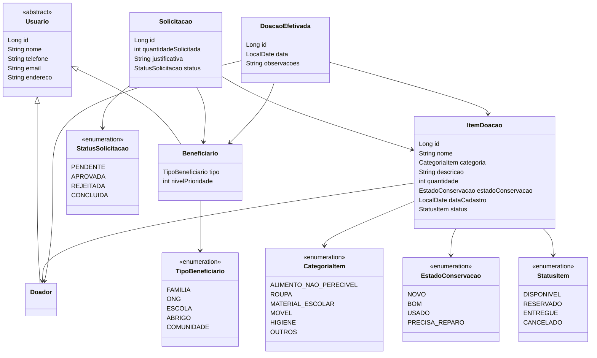

# Diagrama de Classes - Checkpoint 1

```mermaid
classDiagram
    class Usuario {
        <<abstract>>
        Long id
        String nome
        String telefone
        String email
        String endereco
    }

    class Doador

    class Beneficiario {
        TipoBeneficiario tipo
        int nivelPrioridade
    }

    class ItemDoacao {
        Long id
        String nome
        CategoriaItem categoria
        String descricao
        int quantidade
        EstadoConservacao estadoConservacao
        LocalDate dataCadastro
        StatusItem status
    }

    class Solicitacao {
        Long id
        int quantidadeSolicitada
        String justificativa
        StatusSolicitacao status
    }

    class DoacaoEfetivada {
        Long id
        LocalDate data
        String observacoes
    }

    class TipoBeneficiario {
        <<enumeration>>
        FAMILIA
        ONG
        ESCOLA
        ABRIGO
        COMUNIDADE
    }

    class CategoriaItem {
        <<enumeration>>
        ALIMENTO_NAO_PERECIVEL
        ROUPA
        MATERIAL_ESCOLAR
        MOVEL
        HIGIENE
        OUTROS
    }

    class EstadoConservacao {
        <<enumeration>>
        NOVO
        BOM
        USADO
        PRECISA_REPARO
    }

    class StatusItem {
        <<enumeration>>
        DISPONIVEL
        RESERVADO
        ENTREGUE
        CANCELADO
    }

    class StatusSolicitacao {
        <<enumeration>>
        PENDENTE
        APROVADA
        REJEITADA
        CONCLUIDA
    }

    Usuario <|-- Doador
    Usuario <|-- Beneficiario
    Beneficiario --> TipoBeneficiario
    ItemDoacao --> CategoriaItem
    ItemDoacao --> EstadoConservacao
    ItemDoacao --> StatusItem
    ItemDoacao --> Doador
    Solicitacao --> Beneficiario
    Solicitacao --> ItemDoacao
    Solicitacao --> StatusSolicitacao
    DoacaoEfetivada --> ItemDoacao
    DoacaoEfetivada --> Doador
    DoacaoEfetivada --> Beneficiario
```
